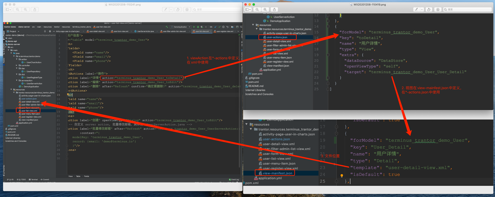

文档见：https://trantor-docs.app.terminus.io/doc/marked/introduction-to-trantor

## trantor为什么能二开

如上图所示，是一个非常典型的从**列表跳转详情**过程，跳转过程为：

1. 跳转详情Action在*-actions.json重定义，在列表视图中使用。
2. Action跳转的页面是extra中的targe所指向的视图定义。
3. 视图定义在view-mainfest.json中，template是视图所在的相对路径。

从上面可以看出，资源的定位是通过`forModel+key`的形式确定的。其实，trantor之所以能够资源进行覆盖，是因为每个资源在trantor都有唯一key。

我们以上面的跳转行为举例，比如原模块有一个视图行为key是`terminus_trantor_demo_Student_toDetail`，二开模块如果想要覆盖这个行为，只要自己也实现一个`terminus_trantor_demo_Student_toDetail`，那么发布到对应的环境后，就存在`terminus_trantor_demo_Student_toDetail`两条记录，用户只要令二开模块的视图行为生效即可。

